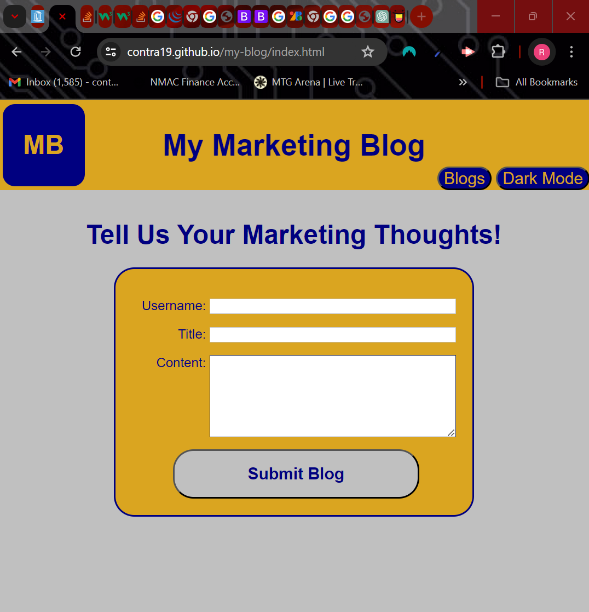
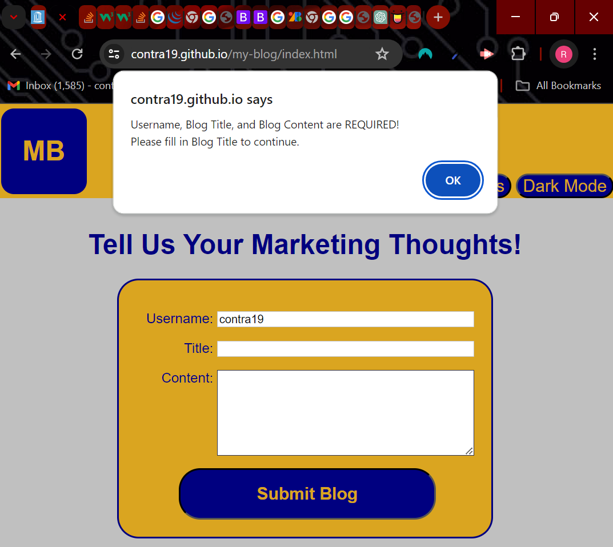
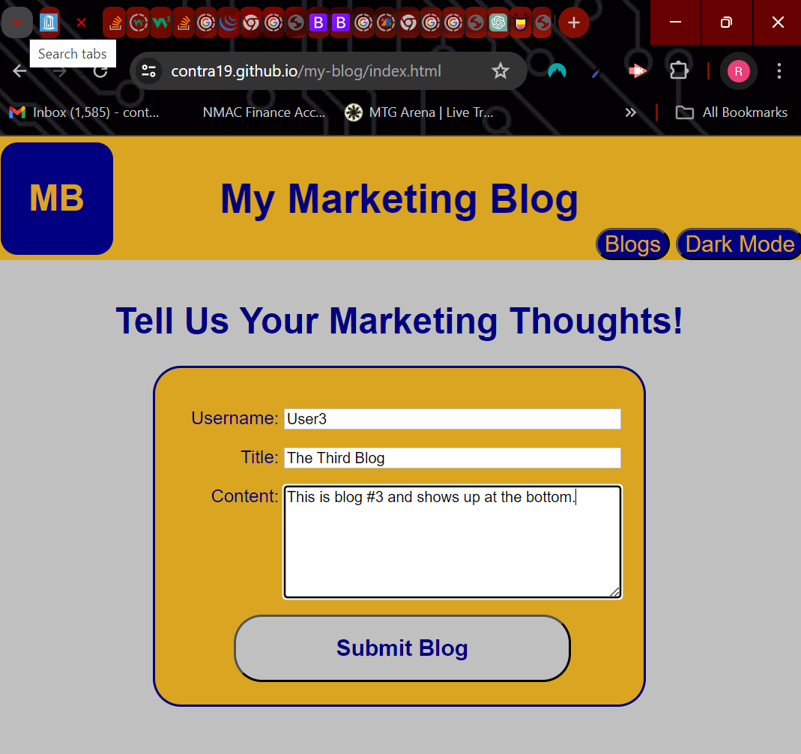
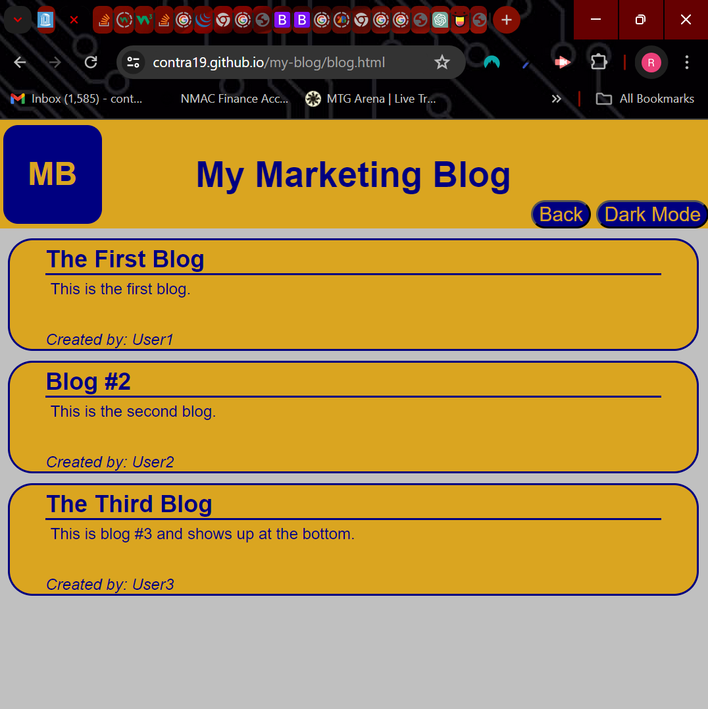
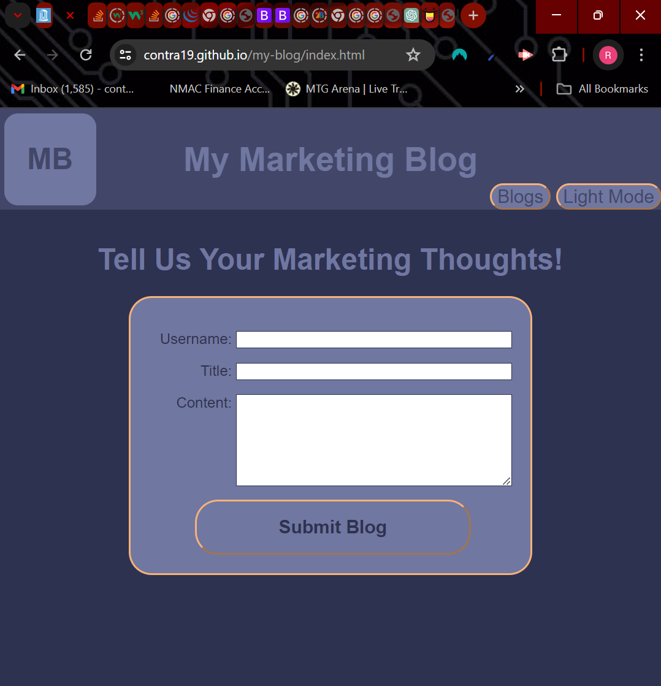

# Personal Marketing Blog

## A web application to record your marketing thoughts!

## Description

The Personal Marketing Blog is a 2 page web application that will allow you to record your marketing thoughts and present them back to you. On the landing page you 
are met with a form which requires you to enter a Username, Title and Content to record your blog. Once entered you can submit your 'marketing thought' by clicking the 'Submit Blog'button. Once stored you will be redirected to the 'Blogs' page where you can see your newly recorder post as well as past posts. The blogs are stored in localStorage in the user's browser. This will make the application information unique for each user. 

The application is built using HTML, CSS and JavaScript. JavaScript was used to create the form and its functionality as well as dynamically generate the list of posts on the 'Blogs' page. There is also a 'Dark Mode' feature that is controlled by a toggle button that is powered by JavaScript.   

## Useage

The Personal Marketing Blog does not need to be installed and can be found at https://contra19.github.io/my-blog/index.html. Once on the page the application is ready to use. 

When you navigate to the main landing page, the user is presented with a form. The user will need to enter a Username, Title and Content before saving the post. If any of the required entries is missing, the user is presented with an alert box telling them what is required before being able to submit the form. 

*Landing Page*

*Alert Message*

When the user fills out all the appropriate fields and clicks on 'Submit Blog', the entry is recorded and the user is forwarded to the 'Blogs' page. Once directed to the 'Blogs' page, the user will be presented with all of their blog entries.(The new blog entry will be at the bottom of the list.) 

*Completed form prior to submission*

*Blogs Page after submission*

Both the Landing Page and the Blogs Page have a "Dark-Mode" toggle button. This can be used to put the page in to a dark color scheme if desired. 

*Landing Page dark-mode*

## Credits
All files were written with original code. Some functions and concepts were developed using code exampled from MDN, W3Schools and exmaples form classroom work. The code was run through AI(chatGPT) to validate.  

## License
The MIT License

Copyright (c) 2024 Robert Wisniewski

Permission is hereby granted, free of charge, to any person obtaining a copy of this software and associated documentation files (the "Software"), to deal in the Software without restriction, including without limitation the rights to use, copy, modify, merge, publish, distribute, sublicense, and/or sell copies of the Software, and to permit persons to whom the Software is furnished to do so, subject to the following conditions:

The above copyright notice and this permission notice shall be included in all copies or substantial portions of the Software.

THE SOFTWARE IS PROVIDED "AS IS", WITHOUT WARRANTY OF ANY KIND, EXPRESS OR IMPLIED, INCLUDING BUT NOT LIMITED TO THE WARRANTIES OF MERCHANTABILITY, FITNESS FOR A PARTICULAR PURPOSE AND NONINFRINGEMENT. IN NO EVENT SHALL THE AUTHORS OR COPYRIGHT HOLDERS BE LIABLE FOR ANY CLAIM, DAMAGES OR OTHER LIABILITY, WHETHER IN AN ACTION OF CONTRACT, TORT OR OTHERWISE, ARISING FROM, OUT OF OR IN CONNECTION WITH THE SOFTWARE OR THE USE OR OTHER DEALINGS IN THE SOFTWARE.